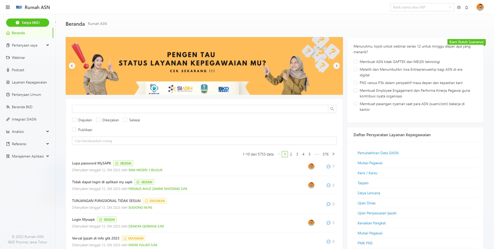
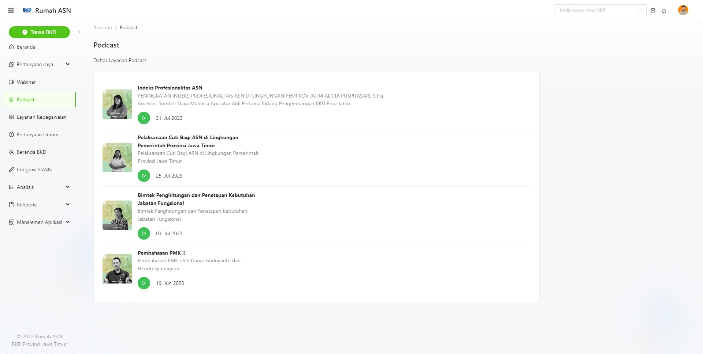
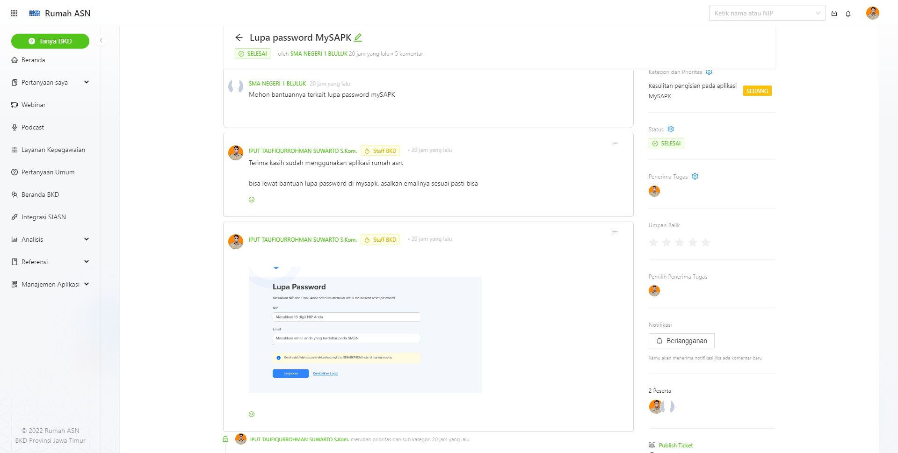
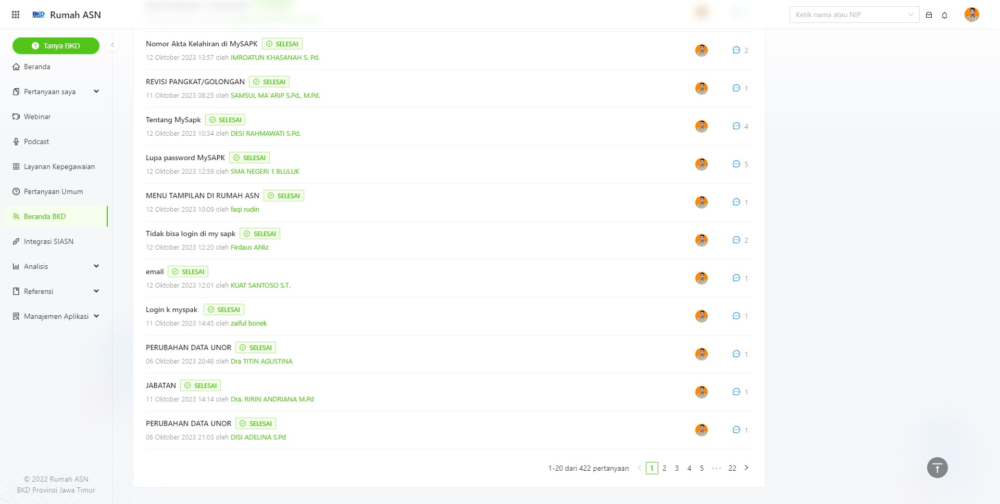
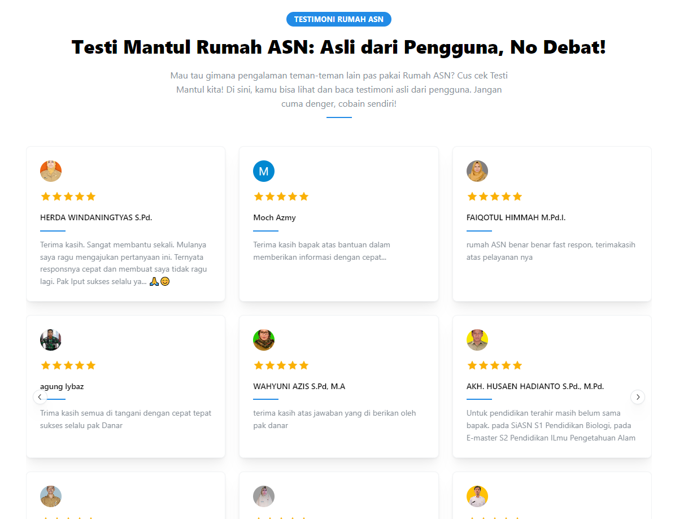
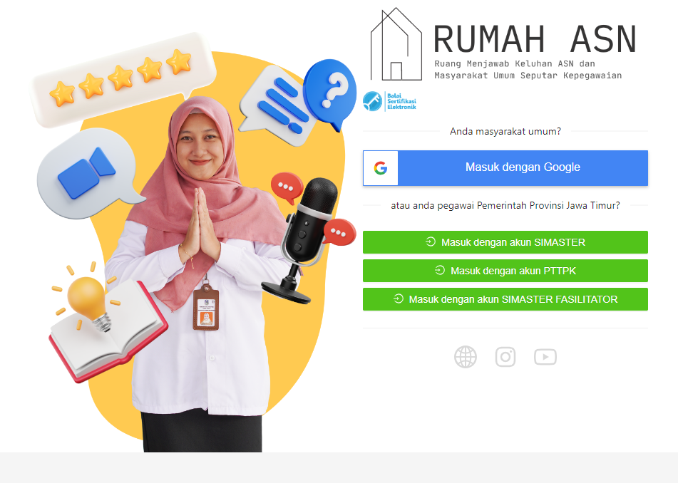

# Aplikasi Rumah ASN

 <!-- Ganti dengan URL screenshot asli -->

## Deskripsi

Aplikasi **Rumah ASN** adalah platform tanya jawab yang dirancang khusus untuk menyelesaikan masalah kepegawaian di Provinsi Jawa Timur. Dikelola oleh BKD Provinsi Jawa Timur, aplikasi ini menyajikan solusi bagi masyarakat umum dan pegawai pemerintah provinsi untuk mendapatkan informasi dan bantuan terkait kepegawaian. Pertanyaan dijawab langsung oleh staf BKD yang kompeten di bidangnya.

## Fitur Utama

- **SSO (Single Sign-On)**: Integrasi login dengan sistem kepegawaian dan Google.
- **Sistem Rating**: Penilaian kinerja pegawai BKD berdasarkan pelayanan.
- **Integrasi SIASN**: Transparansi dan kemudahan akses informasi status kepegawaian.
- **Podcast Kepegawaian**: Materi edukatif berdasarkan pertanyaan populer di Rumah ASN.
- **Webinar**: Seminar online dengan fitur TTE untuk tanda tangan sertifikat.

## Podcast Kepegawaian

Rumah ASN menyediakan podcast kepegawaian yang berisi informasi dan edukasi terkait dunia kepegawaian, berdasarkan pertanyaan terbanyak yang masuk ke platform. Podcast ini dapat diakses oleh masyarakat dan pegawai pemerintah provinsi Jawa Timur untuk menambah wawasan dan pengetahuan mereka.

## Webinar

Rumah ASN juga menyelenggarakan webinar yang dapat diikuti oleh masyarakat dan pegawai pemerintah provinsi. Setiap partisipan yang mengikuti webinar akan mendapatkan sertifikat yang ditandatangani secara elektronik menggunakan TTE.

## Kontribusi

Untuk berkontribusi pada pengembangan aplikasi Rumah ASN, silakan ikuti petunjuk kontribusi yang tersedia, atau hubungi tim pengembang kami.

## Lisensi

Aplikasi ini dilindungi oleh lisensi hak cipta. Untuk informasi lebih lanjut mengenai penggunaan dan distribusi, silakan hubungi developer IT BKD Provinsi Jawa Timur.

## Kontak

Untuk informasi lebih lanjut dan dukungan, silakan hubungi:

- Email: <taufiqurrohman.suwarto@gmail.com>

 <!-- Ganti dengan URL screenshot asli -->
 <!-- Ganti dengan URL screenshot asli -->
 <!-- Ganti dengan URL screenshot asli -->
 <!-- Ganti dengan URL screenshot asli -->
 <!-- Ganti dengan URL screenshot asli -->
